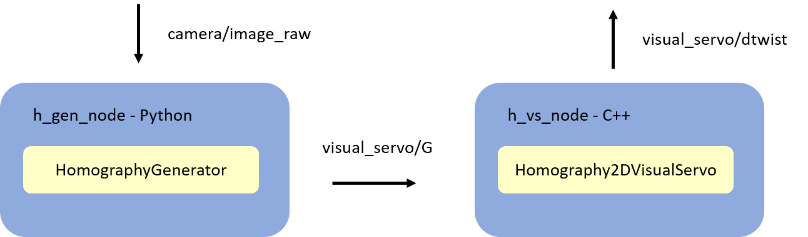

# Homography-based 2D Visual Servoing
Implementation of [Homography-based 2D Visual Servoing](https://ieeexplore.ieee.org/document/1642061) S. Benhimane and E. Malis with ROS integration and homography estimation algorithms.

## Overview
This package runs two nodes

  - [h_gen_node](python/h_gen_node.py), subscribes `camera/image_raw` and has a child of [BaseHomographyGenerator](python/homography_generators/base_homography_generator.py) to compute and publish projective homography `G` to `visual_servo/G`
  - [h_vs_node](src/h_vs_node.cpp), subscribes to `visual_servo/G` and has a [HVs](include/h_vs/h_vs.hpp) to compute and publish angular and linear camera frame velocity to `visual_servo/twist`

Overview shown below
 

## Configuration
Configurations in

  - Camera intrinsics in [cam_params.yml](config/cam_params.yml), can be generated via the [camera_calibration](http://wiki.ros.org/camera_calibration) ROS package
  - Gains in [gain_params.yml](config/gain_params.yml)
